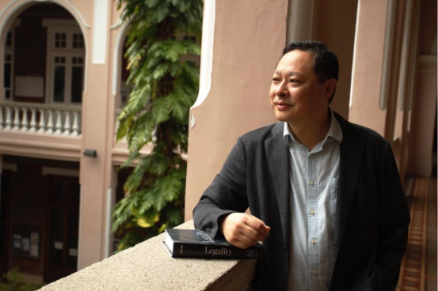

# 思考香港系列
[按此網上閱讀](https://bennytai.github.io/HongKongReflections)

註：系列4網上版尚在整理中，圖表可能不全，如有需要建議下載PDF版，不便之處敬請原諒。

下載PDF

[思考香港系列 1：《論香港獨立： 踩在紅線上的思考》](https://github.com/bennytai/HongKongReflections/releases/download/v1.0/HongKongReflections-01-v1.0.pdf)

[思考香港系列 2：《香港的未來： 跳出框框的思考》](https://github.com/bennytai/HongKongReflections/releases/download/v2.1/HongKongReflections-02-v1.1.pdf)

[思考香港系列 3：《法治的挑戰： 威權下的思考》](https://github.com/bennytai/HongKongReflections/releases/download/v3.0/HongKongReflections-03-v1.0.pdf)

[思考香港系列 4：《雷動： 策略的思考》](https://github.com/bennytai/HongKongReflections/releases/download/v4.0/HongKongReflections-04-v1.0.pdf)

## **作者**

（獲廖中仁先生授權使用此相片）

**戴耀廷** 出生於香港，並於香港受教育。於一九八六年，他獲香港大學法律學士，並於翌年獲香港大學法律專業文憑。畢業後於香港城市理工學院法律系任助理講師。在一九八九年赴英國倫敦大學經濟及政治學院修讀法律，於一九九零年獲頒法律碩士（主修公法）。回港後即開始香港大學法律系的教學工作，現為香港大學法律系副教授，曾任香港大學法律學院副院長。

戴耀廷主要的研究範圍包括香港特別行區基本法、比較憲法、行政法、人權法、宗教與法律、法律與政治、法律與管治、法治與法律文化。

在2013年，他推動「讓愛與和平佔領中環」運動，爭取在香港實現民主普選。在2016年，在立法會選舉中推動「雷動計劃」，爭取非建制派取得過半議席，及鼓勵選民策略投票。在2017年，他提出「風雲計劃」，希望反專制人士能取得超過一半的區議會議席。
